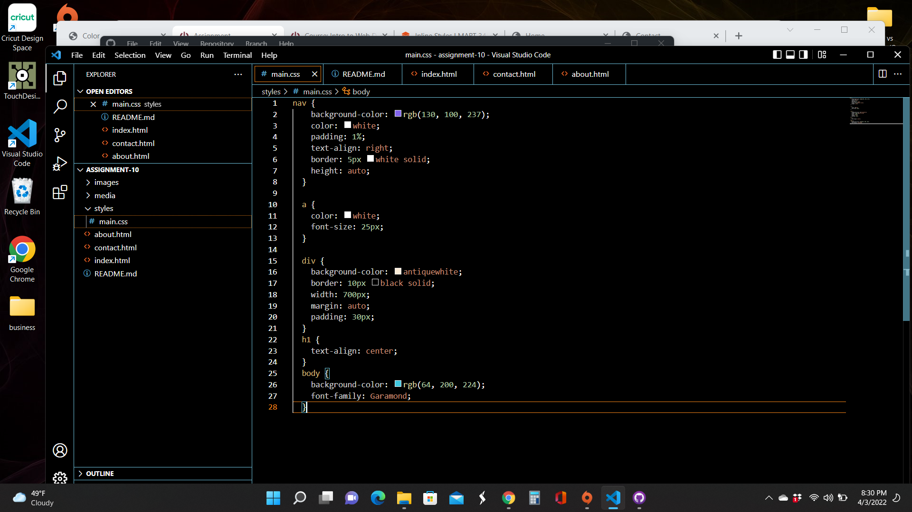

Describe the difference between the universal, element, class, and id selector types. When might you choose one over the other to style content?

Discuss your color palette. How did you choose your colors?
I am drawn to cool colors so I chose some of my favorites for my portfolio.

Optional: discuss any challenges you faced this week, and how you overcame them.

Add Screenshot

