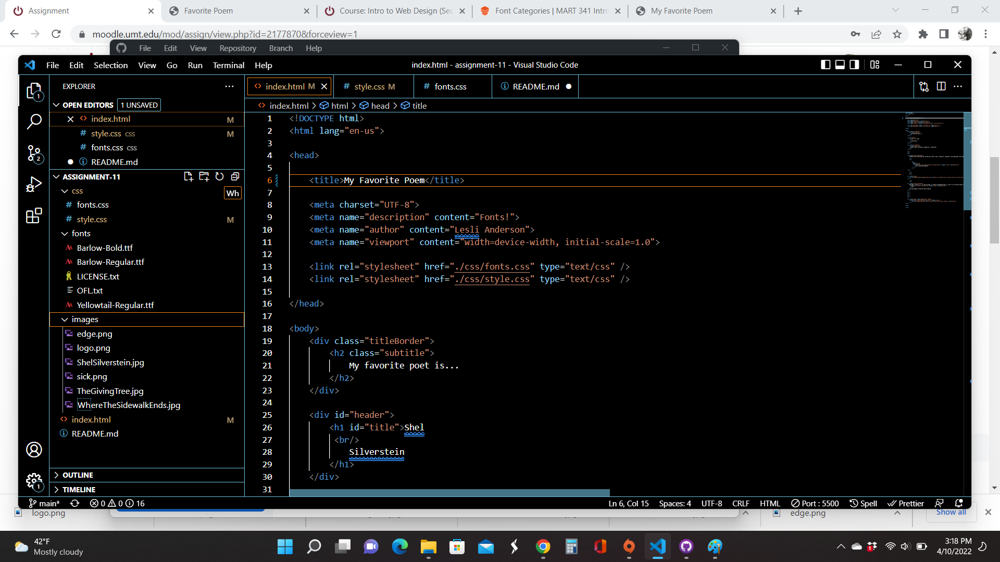

What is typography?
Typography is the art of arranging letters and text in a way that allows content to be legible, visually appealing, and easier to read.

What is the importance of having fallback fonts or a font stack?
Fallback fonts are important to have incase the system being used does not have some of the characters the font chosen has. The fallback font is like a reserve containing symbols for as many Unicode characters as possible.

What is the difference between a system font, web font, and web-safe font?
System fonts are those already installed on your system/computer.

Web fonts are those solely for web use and do not have to be available on a user's device. Menlo and Ubuntu are web fonts.

Web-safe fonts are those fonts that can be counted on being available on all systems (Mac and Windows).

Add Screenshot

