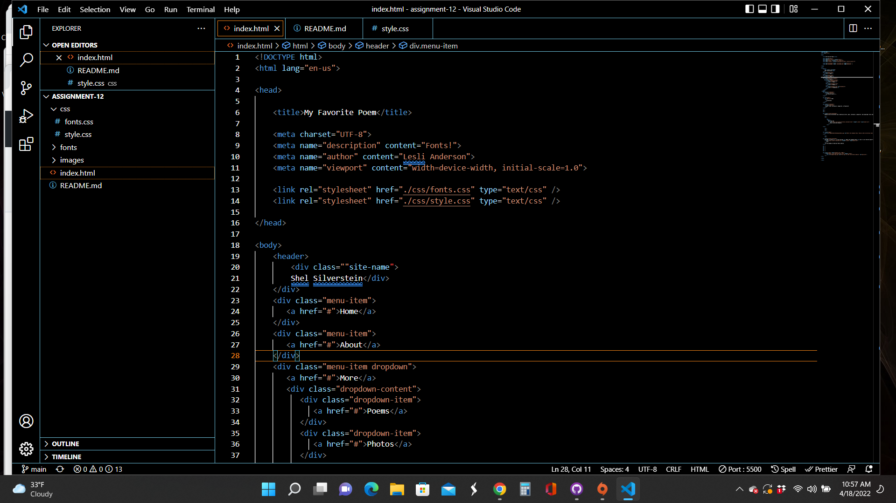

What is the difference between padding, margin, and borders?
Padding: Space between the element's boarder and content
Margin: Space around an element's boarder
Boarder: the outer edge of an element, visible boundary

Optional: how did this week's assignment go? What challenges did you face, and how did you overcome them?
I loved this week's assignment. I am excited about the current content. I enjoy making things look aesthetically pleasing.

Add Screenshot

