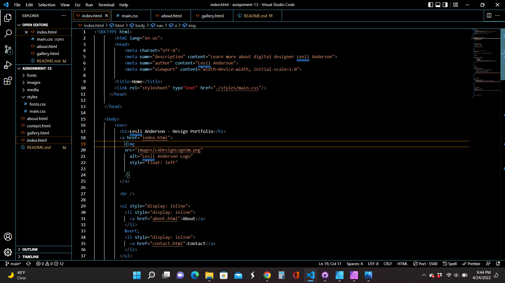

What is the goal of your website? (Think in terms of your user -- why might they visit your site?)
The goal of my website is to highlight my work in a portfolio, and draw some freelance clients as well. Additionally, I hope to develop this site so well that I use it at as an example for my students.

Why is responsive web design important?
A responsive web design plays a critical part in the way your website appears on any device.

Add Screenshot

TO DO - Next Steps
link pages to stylesheets
replace images
correct code for logo
make sure each page is responsive
