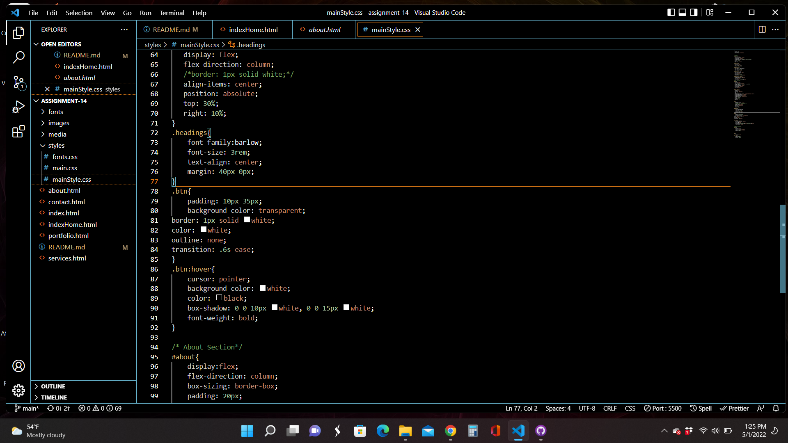

How did your user testing sessions go?

What changes (if any) did you make to your website based on the user feedback you received?

Optional: What challenges did you face this week, and how did you overcome them?

I decided to recreate my site. I wasn't liking where it was going. I found a tutorial that I liked and went from there.
I feel that part of the issue I was having is that I was pulling code from different assignments to create a new portfolio. This created a bit of a mess for me as I was getting my code mixed up, causing the site to behave incorrectly. I like where my site is going now. This is more something I can be proud of.

Add Screenshot

