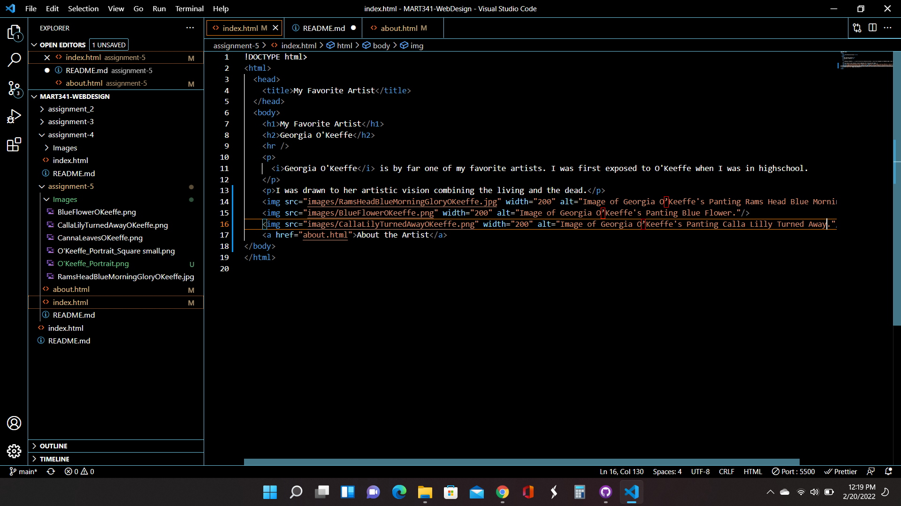

Week 5

Tell me about a website you visited using the Wayback Machine. What year is it from?

    I visited amazon.com on June 10, 2001.

How is the older version different from the current version today in terms of its overall design?

    The Amazon website design feels very messy. Most of the links are highlighted text and not in the form of buttons. Very little hiearchy in the design. Most of the content seems to run together. Very little images and the images that are there are mostly Clipart. Very basic website with no moving elements.

https://www.okeeffemuseum.org/about-georgia-okeeffe/

